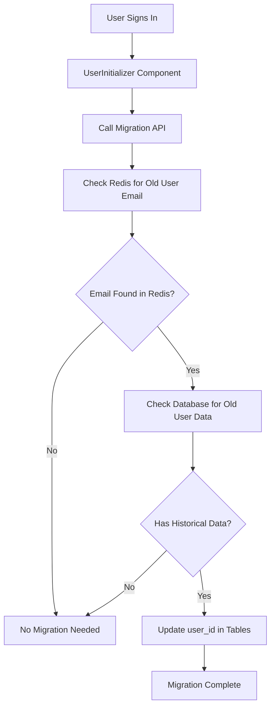

# User Migration Guide

## Overview

This guide explains how to handle user ID migration when old users re-register with new Clerk user IDs but the same email addresses.

## Problem

When old users from the test environment re-register in production, they get new user IDs, but their historical data (applications, subscriptions) remains associated with their old user IDs in the database.

## Solution

We've implemented a comprehensive migration system that automatically detects and handles user re-registration scenarios.

## Components

### 1. Database Tables Affected

- **applications** table - `user_id` field
- **user_subscriptions** table - `user_id` field

### 2. Core Files

#### Scripts
- `/scripts/update-user-ids.js` - Batch migration script
- `/scripts/test-user-migration.js` - Testing and validation script

#### Libraries
- `/lib/user-adapter.ts` - User information adapter (server-only)
- `/lib/user-migration-utils.ts` - Server-side migration utilities
- `/lib/user-migration-client.ts` - Client-side migration helpers

#### API
- `/app/api/user-migration/check/route.ts` - Migration API endpoint

#### Components
- `/components/user-initializer.tsx` - Automatic migration on user sign-in

### 3. Migration Flow



## Usage

### Automatic Migration (Recommended)

The system automatically handles migration when users sign in. No manual intervention required.

1. User signs in with Clerk
2. `UserInitializer` component detects the sign-in
3. Calls the migration API to check for data migration needs
4. If needed, automatically updates database records

### Manual Migration

#### Batch Process All Re-registered Users

```bash
node scripts/update-user-ids.js
```

#### Manual Single User Migration

```bash
node scripts/update-user-ids.js --manual email@example.com new_user_id
```

### Testing

```bash
node scripts/test-user-migration.js
```

## Features

### Safety Features

- **Automatic Backup**: Creates database backup before any changes
- **Detailed Logging**: Comprehensive logs for debugging
- **Error Handling**: Graceful error handling and rollback
- **Test Mode**: Dry-run testing without making actual changes

### Monitoring

- **Real-time Detection**: Identifies re-registered users automatically
- **Redis Integration**: Uses existing Redis mapping for user identification
- **Status Tracking**: Tracks migration status and results

## Data Flow

1. **User Registration Detection**
   - Redis stores mapping: `test_user_email:OLD_USER_ID` → `email@example.com`
   - Re-registration detection: `reregistered_user:email@example.com`

2. **Migration Process**
   - Find old user ID from Redis mapping
   - Check for historical data in database
   - Update `user_id` fields in affected tables
   - Create audit trail

3. **Verification**
   - Confirm data integrity after migration
   - Update tracking records
   - Log migration results

## Configuration

### Environment Variables Required

```env
# Supabase
NEXT_PUBLIC_SUPABASE_URL=your_supabase_url
SUPABASE_SERVICE_ROLE_KEY=your_service_role_key

# Redis (for user mapping)
UPSTASH_REDIS_REST_URL=your_redis_url
UPSTASH_REDIS_REST_TOKEN=your_redis_token
```

## Monitoring and Maintenance

### Check Migration Status

```javascript
// In your application
import { getUserMigrationStatus } from '@/lib/user-migration-utils';

const status = await getUserMigrationStatus(userId, email);
if (status.needsMigration) {
  console.log('User needs migration:', status);
}
```

### View Migration Results

Migration results are saved to:
- `user-id-update-results.json` - Detailed results
- `database-backup-TIMESTAMP.json` - Pre-migration backup

## Troubleshooting

### Common Issues

1. **Redis Connection Failed**
   - Check Redis credentials in environment variables
   - Verify Redis server is accessible

2. **Database Access Errors**
   - Ensure Supabase service role key has proper permissions
   - Check database connection settings

3. **Migration Not Triggered**
   - Verify UserInitializer component is included in app layout
   - Check browser console for client-side errors

### Debug Mode

Enable detailed logging by setting:
```javascript
console.log('[Migration Debug] Enabled');
```

## Best Practices

1. **Always Test First**
   ```bash
   node scripts/test-user-migration.js
   ```

2. **Monitor Migration Results**
   - Review migration result files
   - Check application logs

3. **Backup Before Migration**
   - Automatic backups are created
   - Manual backups recommended for large datasets

4. **Gradual Rollout**
   - Test with small user groups first
   - Monitor system performance during migration

## Support

For issues or questions about the migration system:

1. Check the logs in migration result files
2. Run the test script to diagnose issues
3. Review the backup files if rollback is needed

## Future Enhancements

- Web UI for migration management
- Real-time migration status dashboard
- Automated rollback capabilities
- Performance optimizations for large datasets